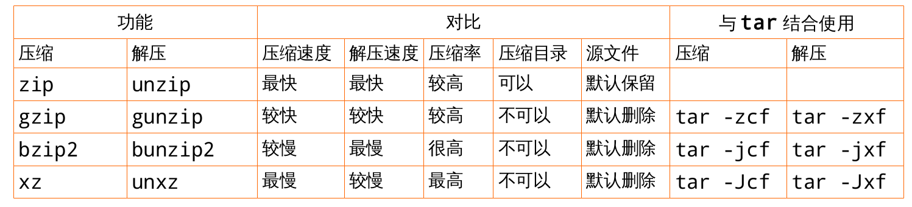

# Linux压缩打包

[TOC]

## 压缩的意义和原理

### 压缩的意义

你是否遇到过以下情况：

- 文件太大, 一个 u 盘无法全部复制? 
- 备份某些重要数据 , 偏偏这些数据量太大了 , 耗掉了你太多的磁盘空间? 

这个时候，“文件压缩”技术可 就派上用场了 !

因为这些比较大型的文件透过所谓的文件压缩技术后 , 可以将他的磁盘使用量降低 , 可以达到减低文件容量的效果 , 此外 , 有的压缩程序还可以进行容量限制 , 使一个大型文件可以分割成为数个小型文件 , 以方便 U盘携带呢 !


### 压缩的原理

目前我们使用的计算机系统中都是使 bytes(字节)单位来计量的! 事实上 , 计算机最小的计量单位应该是 bits (比特)。

1 byte = 8 bits 。

如果让计算机记录 1 这个数字他会如何记录 ?

假设一个 byte 可以看成下面的样子 :

□□□□□□□□

Tips:

1 byte = 8 bits , 所以每个 byte 当中会有 8 个空格 , 而每个空格可以是 0, 或者 1 , 这里仅是做为一个粗略的介绍。由于我们记录数字是 1 , 表示成二进制就是 00000001 , 1 会在最右边占据 1 个 bit , 而其他 的 7 个bits 将会被填上 0 ! 有一种压缩技术示这么做的,他是将重复的数据进行统计记录的。

举个例子说 , 如果你的数据『 111.... 』共有 100 个 1 

那么压缩技术会记录为『 100 个 1 』而不是真的有 100 个 1 的位存在 ! 

简单的说 , 你可以将他想成 , 其实文件里面有相当多的『空间』存在 , 并不是完全填满的 

- 『压缩』 技术就是将这些『空间』填满 , 以让整个文件占用的容量下降 ! 
- 『压缩过的档案』并无法直接被我们的操作系统所使用 , 因此 , 若要使用这些被压缩过的文件数据 , 则必项将他『还原』回到 未压缩前的模样 ,那就是所谓的『解压缩』啰 ! 
- 至于压缩前与压缩后的档案所占用的磁盘空间大小 , 就可以被称为是『压缩比』。


### 压缩与解压缩的好处

最大的好处就是压缩过的文件容量变小了 , 所以你的 硬盘容量无形当中就可以容纳更多的资料。此外 , 在一些网络数据的传输中 , 也会由于数据量的降低 , 好让网络带宽可以用来作更多的工作 ! 而并是老是卡在一些大型的文件传输上面呢 ! 目前很多的 WWW 网站也是利用文件压缩的技术来进行数据的传送 , 好让网站带宽的可利用率上升。

## 压缩打包命令

命令概览

* compress 是一个相当古老的 unix 档案压缩指令。

* gzip 是 GNUzip 的缩写,它是一个 GNU( 全称是 GNU's Not Unix ) 自由软件的文件压缩程序 ; 由于 gzip 可以产生更理想的压缩比例,一般人多已改用 gzip 为档案压缩工具。

* bzip2 是一个基于 Burrows-Wheeler 变换的无损压缩软件,压缩效果比传统的 LZ77/LZ78 压缩算法来得好 ; 若说 gzip 是为了取代 compress 并提供更好的压缩比而成立的,那么 bzip2 则是为了取代 gzip 并提供更佳的压缩比而来的。 bzip2 这玩意的压缩比竟然比 gzip 还要好。

* tar 命令最初的设计目的是将文件备份到磁带上 (tape archive) ,因而得名 tar 。



### .zip

.zip 扩展名表示文件是使用许多 zip 归档程序和压缩程序之一(但不是 gzip )创建的。因为这是一种非常流行的压缩格式,算法的详细描述也有很多,所以可以找到用于所有操作系统的有用的移植形式。这包括创建和扩展带有 .zip 文件扩展名的档案的压缩和解压缩实用程序。在 Linux 上有两种这样的工具:

免费的 Info-ZIP 和以赢利为目的的 PKZIP for Linux 。

如果您只是偶尔需要创建或打开 zip 文件,使用 Info-ZIP 。如果希望使用在 MS-DOS 或其它系统上使用的相同工具,请选择PKZIP ( PKZIP 可用于许多操作系统)。用于微软 Windows 的 WinZIP 和用于 Mac OS 的Stufflt 这两种实用程序可以创建和打开相互之间兼容的档案。

Info-ZIP 在无法使用 gzip 或 tar 的情况下可以提供压缩和解压缩的一个不错的选择,这或许是在Linux 、微软 Windows 和 Mac OS 用户之间交换压缩文件的一种最好的形式。有许多不错的 zip 程序(有开放源码的,也有商业的)可用于这些操作系统,它们应该能确保文件的顺利交换(当然,只要是在特定于某个特定工具的特殊功能关闭的情况下)。

rhel7 默认带有 info-zip 软件

```shell
[root@mastera0 zip-3.0]# which zip
/usr/bin/zip
[root@mastera0 zip-3.0]# rpm -qf /usr/bin/zip
zip-3.0-10.el7.x86_64
[root@mastera0 zip-3.0]# head -n 18 /usr/share/doc/zip-3.0/README
Zip 3.0 is the first Zip update adding large file support. For now Zip 2.3x
remains available and supported, but users should switch to this new release.
Testing for Zip 3.0 has focused mainly on Unix, VMS, Max OS X, and Win32,
and some other ports may not be fully supported yet. If you find your
favorite port is broke, send us the details or, better, send bug fixes. It's
possible that support for some older ports may be dropped in the future.
Copyright (c) 1990-2008 Info-ZIP. All rights reserved.
See the accompanying file LICENSE (the contents of which are also included
in unzip.h, zip.h and wiz.h) for terms of use. If, for some reason, all
of these files are missing, the Info-ZIP license also may be found at:
ftp://ftp.info-zip.org/pub/infozip/license.html and
http://www.info-zip.org/pub/infozip/license.html.
[root@mastera0 ~]# rpm -qi zip
Name
: zip
Version : 3.0
Release : 10.el7
Architecture: x86_64
Install Date: Thu 23 Jun 2016 01:50:41 PM CST
Group
: Applications/Archiving
Size
: 815045License : BSD
Signature : RSA/SHA256, Thu 03 Apr 2014 06:52:17 AM CST, Key ID 199e2f91fd431d51
Source RPM : zip-3.0-10.el7.src.rpm
Build Date : Tue 28 Jan 2014 06:35:49 AM CST
Build Host : x86-019.build.eng.bos.redhat.com
Relocations : (not relocatable)
Packager : Red Hat, Inc. <http://bugzilla.redhat.com/bugzilla>
Vendor
: Red Hat, Inc.
URL
: http://www.info-zip.org/Zip.html
Summary : A file compression and packaging utility compatible with PKZIP
Description :
The zip program is a compression and file packaging utility. Zip is
analogous to a combination of the UNIX tar and compress commands and
is compatible with PKZIP (a compression and file packaging utility for
MS-DOS systems).
Install the zip package if you need to compress files using the zip
program.
```

#### zip 命令用法

zip 命令可以用来解压缩文件,或者对文件进行打包操作。 zip 是个使用广泛的压缩程序,文件经它压缩后会另外产生具有 “ .zip” 扩展名的压缩文件。

```shell
语法 zip( 选项 )( 参数 )

选项

-A :调整可执行的自动解压缩文件;
-b< 工作目录 > :指定暂时存放文件的目录;
-c :替每个被压缩的文件加上注释;
-d :从压缩文件内删除指定的文件;
-D :压缩文件内不建立目录名称;
-f :此参数的效果和指定 “ -u” 参数类似,但不仅更新既有文件,如果某些文件原本不存在于压缩文
件内,使用本参数会一并将其加入压缩文件中;
-F :尝试修复已损坏的压缩文件;
-g :将文件压缩后附加在已有的压缩文件之后,而非另行建立新的压缩文件;
-h :在线帮助;
-i< 范本样式 > :只压缩符合条件的文件;
-j :只保存文件名称及其内容,而不存放任何目录名称;
-J :删除压缩文件前面不必要的数据;
-k :使用 MS-DOS 兼容格式的文件名称;
-l :压缩文件时,把 LF 字符置换成 LF+CR 字符;
-ll :压缩文件时,把 LF+cp 字符置换成 LF 字符;
-L :显示版权信息;
-m :将文件压缩并加入压缩文件后,删除原始文件,即把文件移到压缩文件中;
-n< 字尾字符串 > :不压缩具有特定字尾字符串的文件;
-o :以压缩文件内拥有最新更改时间的文件为准,将压缩文件的更改时间设成和该文件相同;
-q :不显示指令执行过程;
-r :递归处理,将指定目录下的所有文件和子目录一并处理;
-S :包含系统和隐藏文件;
-t< 日期时间 > :把压缩文件的日期设成指定的日期;
-T :检查备份文件内的每个文件是否正确无误;
-u :更换较新的文件到压缩文件内;
-v :显示指令执行过程或显示版本信息;
-V :保存 VMS 操作系统的文件属性;
-w :在文件名称里假如版本编号,本参数仅在 VMS 操作系统下有效;
-x< 范本样式 > :压缩时排除符合条件的文件;
-X :不保存额外的文件属性;
-y :直接保存符号连接,而非该链接所指向的文件,本参数仅在 UNIX 之类的系统下有效;
-z :替压缩文件加上注释;
-$ :保存第一个被压缩文件所在磁盘的卷册名称;
-< 压缩效率 > :压缩效率是一个介于 1~9 的数值。
参数
zip 压缩包:指定要创建的 zip 压缩包;
文件列表:指定要压缩的文件列表。
实例
zip -q -r html.zip /home/Blinux/html
zip -q -r html.zip *
```

#### unzip 的用法

unzip 命令用于解压缩由 zip 命令压缩的 “ .zip” 压缩包

```shell
语法 unzip( 选项 )( 参数 )

选项

-c :将解压缩的结果显示到屏幕上,并对字符做适当的转换;
-f :更新现有的文件;
-l :显示压缩文件内所包含的文件;
-p :与 -c 参数类似,会将解压缩的结果显示到屏幕上,但不会执行任何的转换;
-t :检查压缩文件是否正确;
-u :与 -f 参数类似,但是除了更新现有的文件外,也会将压缩文件中的其他文件解压缩到目录中;
-v :执行时显示详细的信息;
-z :仅显示压缩文件的备注文字;
-a :对文本文件进行必要的字符转换;
-b :不要对文本文件进行字符转换;
-C :压缩文件中的文件名称区分大小写;
-j :不处理压缩文件中原有的目录路径;
-L :将压缩文件中的全部文件名改为小写;
-M :将输出结果送到 more 程序处理;
-n :解压缩时不要覆盖原有的文件;
-o :不必先询问用户, unzip 执行后覆盖原有的文件;
-P< 密码 > :使用 zip 的密码选项;
-q :执行时不显示任何信息;
-s :将文件名中的空白字符转换为底线字符;
-V :保留 VMS 的文件版本信息;
-X :解压缩时同时回存文件原来的 UID/GID ;
-d< 目录 > :指定文件解压缩后所要存储的目录;
-x< 文件 > :指定不要处理 .zip 压缩文件中的哪些文件;
-Z : unzip-Z 等于执行 zipinfo 指令

参数 压缩包:指定要解压的 “ .zip” 压缩包。

实例

unzip test.zip
unzip -v test.zip
unzip -n test.zip -d /tmp
```

### .gz

#### gzip 的用法

gzip 命令用来压缩文件。 gzip 是个使用广泛的压缩程序,文件经它压缩过后,其名称后面会多处 “ .gz”扩展名。 gzip 是在 Linux 系统中经常使用的一个对文件进行压缩和解压缩的命令,既方便又好用。

gzip 不仅可以用来压缩大的、较少使用的文件以节省磁盘空间,还可以和 tar 命令一起构成 Linux 操作系统中比较流行的压缩文件格式。据统计, gzip 命令对文本文件有 60% ~ 70% 的压缩率。减少文件大小有两个明显的好处,一是可以减少存储空间,二是通过网络传输文件时,可以减少传输的时间。

```shell
语法 gzip( 选项 )( 参数 )

选项

-a 或 —— ascii :使用 ASCII 文字模式;
-d 或 --decompress 或 ----uncompress :解开压缩文件;
-f 或 —— force :强行压缩文件。不理会文件名称或硬连接是否存在以及该文件是否为符号连接;
-h 或 —— help :在线帮助;
-l 或 —— list :列出压缩文件的相关信息;
-L 或 —— license :显示版本与版权信息;
-n 或 --no-name :压缩文件时,不保存原来的文件名称及时间戳记;
-N 或 —— name :压缩文件时,保存原来的文件名称及时间戳记;
-q 或 —— quiet :不显示警告信息;
-r 或 —— recursive :递归处理,将指定目录下的所有文件及子目录一并处理;
-S 或 < 压缩字尾字符串 > 或 ----suffix< 压缩字尾字符串 > :更改压缩字尾字符串;
-t 或 —— test :测试压缩文件是否正确无误;
-v 或 —— verbose :显示指令执行过程;
-V 或 —— version :显示版本信息;
-< 压缩效率 > :压缩效率是一个介于 1~9 的数值,预设值为 “ 6” ,指定愈大的数值,压缩效率就会
愈高;
--best :此参数的效果和指定 “ -9” 参数相同;
--fast :此参数的效果和指定 “ -1” 参数相同。

参数 文件列表:指定要压缩的文件或指定要解压的文件。。

实例

gzip * 将当前目录下的每个文件都压缩成 .gz 文件
gzip test 将 test 文件压缩成 test.gz 文件并删除源文件
gzip -rv /tmp 第归压缩目录中的所有文件,压缩成 .gz 结尾的文件,并显示指令执行过程
gizp -dr /tmp 第归解压 /tmp 目录下的 .gz 结尾的文件
```

#### gunzip 的用法

gunzip 命令用来解压缩文件。 gunzip 是个使用广泛的解压缩程序,它用于解开被 gzip 压缩过的文件,这些压缩文件预设最后的扩展名为 .gz 。其实压缩或解压缩,都可通过 gzip 指令单独完成。

```shell
语法 gunzip( 选项 )( 参数 )

选项

-a 或 —— ascii :使用 ASCII 文字模式;
-c 或 --stdout 或 --to-stdout :把解压后的文件输出到标准输出设备;
-f 或 -force :强行解开压缩文件,不理会文件名称或硬连接是否存在以及该文件是否为符号连接;
-h 或 —— help :在线帮助;
-l 或 —— list :列出压缩文件的相关信息;
-L 或 —— license :显示版本与版权信息;
-n 或 --no-name :解压缩时,若压缩文件内含有原来的文件名称及时间戳记,则将其忽略不予处理;
-N 或 —— name :解压缩时,若压缩文件内含有原来的文件名称及时间戳记,则将其回存到解开
的文件上;
-q 或 —— quiet :不显示警告信息;
-r 或 —— recursive :递归处理,将指定目录下的所有文件及子目录一并处理;
-S 或 < 压缩字尾字符串 > 或 ----suffix< 压缩字尾字符串 > :更改压缩字尾字符串;
-t 或 —— test :测试压缩文件是否正确无误;
-v 或 —— verbose :显示指令执行过程;
-V 或 —— version :显示版本信息;

参数 文件列表:指定要解压的压缩包。

实例
gzip -d test.gz
gunzip test.gz
效果一样
```

### .bz2

#### bzip2 的用法

bzip2 命令用于创建和管理(包括解压缩) “ .bz2” 格式的压缩包。

```shell
语法 bzip2( 选项 )( 参数 )

选项

-c 或 —— stdout :将压缩与解压缩的结果送到标准输出;
-d 或 —— decompress :执行解压缩;
-f 或 -force : bzip2 在压缩或解压缩时,若输出文件与现有文件同名,预设不会覆盖现有文件。若
要覆盖。请使用此参数;
-h 或 —— help :在线帮助;
-k 或 —— keep : bzip2 在压缩或解压缩后,会删除原始文件。若要保留原始文件,请使用此参数;
-s 或 —— small :降低程序执行时内存的使用量;
-t 或 —— test :测试 .bz2 压缩文件的完整性;
-v 或 —— verbose :压缩或解压缩文件时,显示详细的信息;
-z 或 —— compress :强制执行压缩;
-V 或 —— version :显示版本信息;
--repetitive-best :若文件中有重复出现的资料时,可利用此参数提高压缩效果;
--repetitive-fast :若文件中有重复出现的资料时,可利用此参数加快执行效果。

参数 文件列表:指定要压缩的文件或指定要解压的文件。

实例

bzip2 test 压缩 test 文件,生成压缩文件 test.bz2 ,并删除源文件
bzip2 -k test 压缩 test 文件,生成压缩文件 test.bz2 ,并保留源文件
bzip2 -d test.bz2 解压文件
bunzip2 test.bz2 解压文件
```

#### bunzip2 的用法

bunzip2 命令解压缩由 bzip2 指令创建的 ” .bz2" 压缩包。对文件进行压缩与解压缩。此命令类似于“ gzip/gunzip” 命令,只能对文件进行压缩。对于目录只能压缩目录下的所有文件,压缩完成后,在目录下生成以 “ .bz2” 为后缀的压缩包。 bunzip2 其实是 bzip2 的符号链接,即软链接,因此压缩解压都可以通过 bzip2 实现。

```shell
[root@mastera0 ~]# which bzip2
/usr/bin/bzip2
[root@mastera0 ~]# which bunzip2
/usr/bin/bunzip2
[root@mastera0 ~]# ll -i /usr/bin/bzip2
33853111 -rwxr-xr-x. 1 root root 36752 Jul 31 2014 /usr/bin/bzip2
[root@mastera0 ~]# ll -i /usr/bin/bunzip2
34293684 lrwxrwxrwx. 1 root root 5 Jun 23 13:50 /usr/bin/bunzip2 -> bzip2

bunzip2 [ -fkvsVL ] [ filenames ... ]

-f 或 --force :解压缩时,若输出的文件与现有文件同名时,预设不会覆盖现有的文件;
-k 或 --keep :在解压缩后,预设会删除原来的压缩文件。若要保留压缩文件,请使用此参数;
-s 或 --small :降低程序执行时,内存的使用量;
-v 或 --verbose :解压缩文件时,显示详细的信息;
-l , --license , -V 或 —— version :显示版本信息。
```


### .xz

XZ Utils 是为 POSIX 平台开发具有高压缩率的工具。它使用 LZMA2 压缩算法,生成的压缩文件比POSIX 平台传统使用的 gzip、bzip2 生成的压缩文件更小,而且解压缩速度也很快。最初 XZ Utils的是基于 LZMA-SDK 开发,但是 LZMA-SDK 包含了一些 WINDOWS 平台的特性,所以 XZ Utils 为以适应 POSIX 平台作了大幅的修改。XZ Utils 的出现也是为了取代 POSIX 系统中旧的 LZMA Utils。XZ Utils 主要包含了下列部分:

* 命令行程序 xz ,用来生成和解压缩 .xz 压缩文件。
* 一组实用的脚本工具 (xzcat, xdiff, xzgrep 等)提供浏览,查找以及比较 .xz 文件内
容等功能。
* liblzma 压缩库,提供算法的实现和近似于 ZLIB 的编程接口。
* 提供对 LZMA Utils 的一些兼容

xz 文件格式

XZ Utils 工具生成的压缩文件扩展名为 .xz (MIME 类型为"application/x-xz")。

.xz 文件格式具有下列特点:

* 基于数据流: 易于通过管道 (pipe) 生成压缩文件或解压缩文件。.xz 文件格式与 .gz/.bz2 文件一样,不具备对多个文件进行归档打包的能力。若要处理多个文件,可以和归档工具 tar 结合使用,生成扩展名为 .tar.xz 或 .txz 的压缩文件。
* 随机读取: 存储的数据被划分为独立的压缩块,并对每个压缩块进行索引,当每个压缩块比较小时,便能够进行有限的随机读取压缩数据。
* 完整性验证: 可以使用 CRC32、CRC64、SHA-256 来进行数据的完整性验证,也可以增加自定义验证方法。
* 可连接(concatenation): 类似于 .gz/.bz2 文件,可以把多个压缩数据流连接到一个文件中。解压缩时,就像解压一个正常单压缩流文件一样。
* 支持多 filter 和 filter 链: 提供自定义 filter 的能力,也能够将多个 filter 组成filter 链,对数据进行处理。这点与 Unix 命令间使用的管道 (pipe) 类似。
* 可填充(padding): 可以在 .xz 文件末尾填充二进制'0'以充满特定大小的空间,比如备份磁带上的一个块 (block)。

XZ Utils 具有高压缩率,解压速度快的特点。能够生成更小文件的同时,也能提供稳定快速的解压,在对数据大小比较敏感的场合,比如说大数据的网络传输,文件的备份,处理能力有限的嵌入系统等场合,有着十分广泛的用途。

#### xz 命令用法

```shell
语法 xz ( 选项 )( 参数 )

选项

-z, --compress
force compression 强制压缩
-d, --decompress, --uncompress
force decompression 解开压缩文件
-t, --test test compressed file integrity 测试压缩文件是否正确无误
-l, --list list information about .xz files 列出压缩文件的相关信息
-k, --keep keep (don't delete) input files 不删除源文件
-f, --force force overwrite of output file and (de)compress links 强制压缩,覆盖输出文件同名的文件
-c, --stdout, --to-stdout write to standard output and don't delete input files 写入标准输出,不要删除输入文件
-0 ... -9 compression preset; default is 6; take compressor *and* decompressor memory usage into account before using 7-9! 压缩效率是一个介于
1~9 的数值,预设值为 “ 6” ,指定愈大的数值,压缩效率就会愈高;解压由县考虑使用 7-9
-e, --extreme try to improve compression ratio by using more CPU time; does not affect decompressor memory requirements 通过使用更多的处理器时间
来提高压缩比;不影响解压时的内存需求
-T, --threads=NUM use at most NUM threads; the default is 1; set to 0 to use the number of processor cores 最多使用的线程数量,默认为 1 ,如果设置为
0 去使用处理器内核的数量
-q, --quiet suppress warnings; specify twice to suppress errors too 抑制警告;指定两次
以抑制错误
-v, --verbose be verbose; specify twice for even more verbose
-h, --help display this short help and exit
-H, --long-help display the long help (lists also the advanced options)
-V, --version display the version number and exit

参数 文件列表:指定要压缩的文件列表。

实例
xz test 压缩一个文件 test ,压缩成功后删除源文件
xz -d -k test.xz 解压 test.xz 文件, -k 参数保证源文件不被删除
xz -l test.xz 查看基本信息,包括压缩率等
xz -k7 test 使用参数 -0, -1, -2, ... -6, ... -9 或参数 --fast, --best 设定压缩率。 xz 命令的默认为-6 。
借助 xargs 命令并行压缩多文件。下面的命令行可以将 /var/log 目录下所有的扩展名为 .log 的文件压缩。通过 xargs 命令同时运行多个 xz 进行压缩。
find /var/log -type f -iname "*.log" -print0 | xargs -P4 -n16 xz -T1
注意:运行此命令须有 root 权限。
```


### tar

tar 命令可以为 linux 的文件和目录创建档案。利用 tar ,可以为某一特定文件创建档案(备份文件),也可以在档案中改变文件,或者向档案中加入新的文件。 tar 最初被用来在磁带上创建档案,现在,用户可以在任何设备上创建档案。利用 tar 命令,可以把一大堆的文件和目录全部打包成一个文件,这对于备份文件或将几个文件组合成为一个文件以便于网络传输是非常有用的。

首先要弄清两个概念:打包和压缩。

* 打包是指将一大堆文件或目录变成一个总的文件;
* 压缩则是将一个大的文件通过一些压缩算法变成一个小文件。

为什么要区分这两个概念呢?

这源于 Linux 中很多压缩程序只能针对一个文件进行压缩,这样当你想要压缩一大堆文件时,你得先将这一大堆文件先打成一个包( tar 命令),然后再用压缩程序进行压缩( gzip bzip2 命令)。

```shell
语法 tar ( 选项 )( 参数 )

选项
-A 或 --catenate :新增文件到以存在的备份文件;
-B :设置区块大小;
-c 或 --create :建立新的备份文件;
-C < 目录 > :这个选项用在解压缩,若要在特定目录解压缩,可以使用这个选项。
-d :记录文件的差别;
-x 或 --extract 或 --get :从备份文件中还原文件;
-t 或 --list :列出备份文件的内容;
-z 或 --gzip 或 --ungzip :通过 gzip 指令处理备份文件;
-Z 或 --compress 或 --uncompress :通过 compress 指令处理备份文件;
-f< 备份文件 > 或 --file=< 备份文件 > :指定备份文件;
-v 或 --verbose :显示指令执行过程;
-r :添加文件到已经压缩的文件;
-u :添加改变了和现有的文件到已经存在的压缩文件;
-j :支持 bzip2 解压文件;
-J :支持 xz 解压文件;
-v :显示操作过程;
-l :文件系统边界设置;
-k :保留原有文件不覆盖;
-m :保留文件不被覆盖;
-w :确认压缩文件的正确性;
-p 或 --same-permissions :用原来的文件权限还原文件;
-P 或 --absolute-names :文件名使用绝对名称,不移除文件名称前的 “ /” 号;
-N < 日期格式 > 或 --newer=< 日期时间 > :只将较指定日期更新的文件保存到备份文件里;
--exclude=< 范本样式 > :排除符合范本样式的文件。

参数 文件列表:指定要打包的文件或目录列表。

实例
tar -cvf log.tar log2012.log 仅打包,不压缩! tar -xf 解压
tar -zcvf log.tar.gz log2012.log 打包后,以 gzip 压缩 tar -zxf 解压
tar -jcvf log.tar.bz2 log2012.log 打包后,以 bzip2 压缩 tar -jxf 解压
tar -Jcvf log.tar.xz log2012.log 打包后,以 xz 压缩 tar -Jxf 解压
tar -tf log.tar 查看打包文件
注意 -f 参数后面必须接文件名
```

## 04-Linux压缩打包课后习题

1. 通过dd创建4个5M的文件,分别为afile;bfile;cfile;dfile,并将这4个文件放在/tmp/test目录中保存
2. 对这4个相同大小的文件进行压缩,分别使用zip;bzip2;gzip;xz,并观察
3. 在将压缩文件进行解压,并观察
4. 将/tmp/test目录进行打包,分别使用gzip和bzip2压缩
