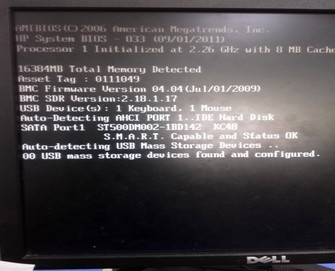
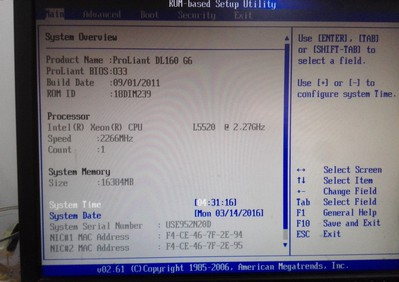
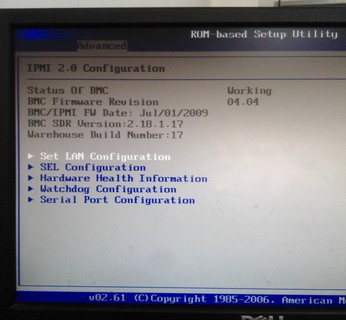
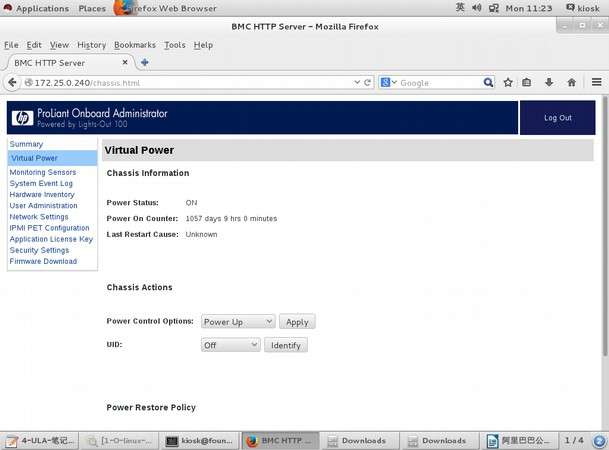
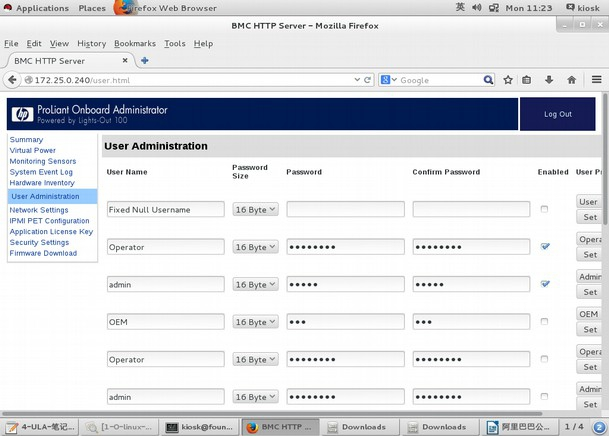
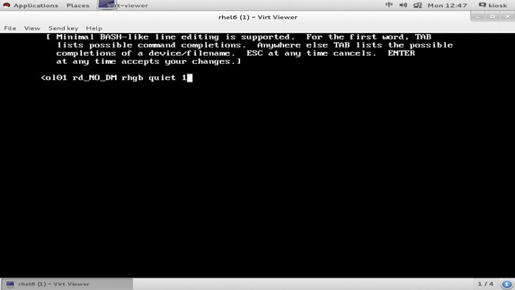
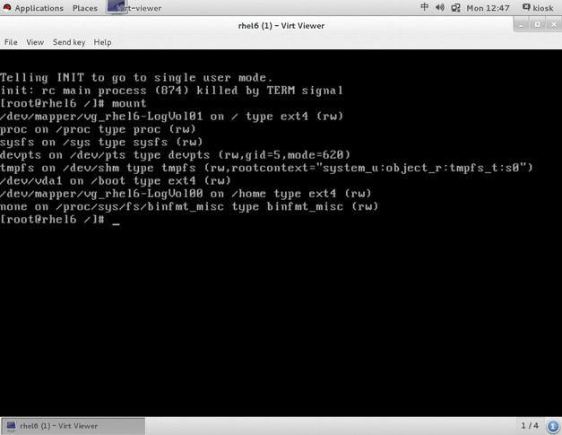
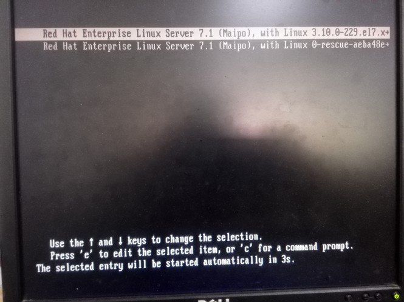
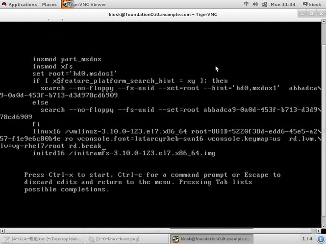

# Linux 开机启动流程

[TOC]

## 启动流程概览

1. 加载 BIOS 的硬件信息并自我测试 , 依据设定取得第一个可开机的装置 ;
2. 读取并执行第一个开机装置内 MBR 的 boot Loader ( grub, spfdisk 等程序 );
3. 依据 boot loader 的设定加载 Kernel
4. Kernel 会开始侦测硬件并加载驱动程序 ;
5. 在硬件驱动成功后 ,Kernel 会主动呼叫 init 程序
6. init 会取得 run-level 信息 ;
7. init 执行 /etc/rc.d/rc.sysinit 档案来准备软件执行的作业环境 ( 如网络、时区等 );
8. init 执行 run-level 的各个服务的启动 (script 方式 );
9. init 执行 /etc/rc.d/rc.local 档案 ;
10. init 执行终端仿真程序 mingetty 来启动 login 程序 ,
11. 最后等待用户登入

## 详细讲解

### 开机软件 —— BIOS、Grub


#### 名词解释

1. BIOS 一个写入到主板上的一个软件程序,在开机的时候,计算机系统会主动执行第一个程序
2. HD 硬盘
3. MBR 主要启动记录区(Master Boot Record)该硬盘里的第一个扇区 512 bytes
4. boot loader 开机管理程序,可读取核心文件并执行 446 bytes
5. DPT 磁盘分割表(disk partition table)记录整颗硬盘分割状态 64 bytes
6. 55AA 2 bytes

#### 流程解释

* 通电后,服务器主版上的一个软件 BIOS 启动,他的任务就是找到带有开机程序的设备,此处以硬盘为例, BIOS 的任务结束;
* 该硬盘上的第一个扇区中有一个开机管理程序, rhel6 上为 grub1 , rhel7 上为 grub2 ,版本不同;
* 接下去就是 grub 在工作了。

#### BIOS

*开机时按下 pause break 暂停中断,可以看到 bios 的大概信息:*



AMIBIOS(C)2006 American Megatrends, Inc.

基本输入输出系统的版本为 AMIBIOS ,为美国趋势科技

2006 年生产

HP System BIOS – 033 (09/01/2011)

惠普系统的基本输入输出系统,支持到 2011/01/09 的硬件

Processor 1 Initiallized at 2.26 GHz with 8 MB cache

处理器 cpu 一个,频率为 2.26GHz , 8M 缓冲

16384MB Total Memory Detected

16G 内存

Asset Tag : 0111049

资产编号为 0111049

BMC Firmware Version 04.04(Jul/01/2009)

BMC SDR Version : 2.18.1.17

basebiard management controller 底板管理控制器的缩写,时一个在 IPMI 结构下提供智能管理的控制器

IPMI 时智能平台管理界面,即与 intel 结构的企业系统中所使用外围设备采用的一种工业标准。

USB Device(s) : 1 Keyboard , 1 Mouse

usb 设备有一个鼠标一个键盘,此处可以查看是否有人恶意用 usb 设备要攻击服务器

Auto-Detecting AHCI PORT 1 .. IDE Hard Disk 自动检测

*开机按下 F10 ,进入 BIOS 管理界面*






*IPMI*

HP 服务器远程管理平台





### 开机文档 —— menu.lst、grub.conf

#### Grub 配置文档

* menu.lst
* grub.conf

```shell
[root@rhel6 grub]# ll /boot/grub/
total 274
-rw-r--r--. 1 root root 63 Jul 2 2015 device.map
-rw-r--r--. 1 root root 13380 Jul 2 2015 e2fs_stage1_5
-rw-r--r--. 1 root root 12620 Jul 2 2015 fat_stage1_5
-rw-r--r--. 1 root root 11748 Jul 2 2015 ffs_stage1_5
-rw-------. 1 root root 796 Jul 2 2015 grub.conf
-rw-r--r--. 1 root root 11756 Jul 2 2015 iso9660_stage1_5
-rw-r--r--. 1 root root 13268 Jul 2 2015 jfs_stage1_5
lrwxrwxrwx. 1 root root 11 Jul 2 2015 menu.lst -> ./grub.conf
-rw-r--r--. 1 root root 11956 Jul 2 2015 minix_stage1_5
-rw-r--r--. 1 root root 14412 Jul 2 2015 reiserfs_stage1_5
-rw-r--r--. 1 root root 1341 May 7 2010 splash.xpm.gz
-rw-r--r--. 1 root root 512 Jul 2 2015 stage1
-rw-r--r--. 1 root root 126100 Jul 2 2015 stage2
-rw-r--r--. 1 root root 12024 Jul 2 2015 ufs2_stage1_5
-rw-r--r--. 1 root root 11364 Jul 2 2015 vstafs_stage1_5
-rw-r--r--. 1 root root 13964 Jul 2 2015 xfs_stage1_5
[root@rhel6 grub]# vim grub.conf
default=0		===>默认菜单
timeout=5		===>启动菜单超时5秒进入默认启动内核
splashimage=(hd0,0)/grub/splash.xpm.gz	===>菜单的背景图片位置
hiddenmenu		===>默认不看启动菜单
title Red Hat Enterprise Linux (2.6.32-431.el6.x86_64)
开机启动的系统名称(可以更改对其他没有影响),指定启动硬盘位置在第一个硬盘的第一个分区
root (hd0,0)
指定核心文件的名称及位置 /boot/ ,指定语言等等
kernel /vmlinuz-2.6.32-431.el6.x86_64 ro root=/dev/mapper/vg_rhel6-LogVol01 rd_NO_LUKS
LANG=en_US.UTF-8 rd_NO_MD SYSFONT=latarcyrheb-sun16 KEYBOARDTYPE=pc
KEYTABLE=us rd_LVM_LV=vg_rhel6/LogVol01 rd_NO_DM rhgb quiet
指定核心加载的模块文件 /boot/
initrd /initramfs-2.6.32-431.el6.x86_64.img
```

#### 流程解释

* grub 软件的任务就是找到核心文件,并加载该文件
* 内核的第一任务就是驱动硬件
* 内核第二任务就是呼叫 init 程序,接下来就交给 init 了

### init 程序

#### 流程解释

- init 程序挂接 /etc 和 /lib 所在的目录分区
- 执行 /etc/inittab 文件,取得 run-level 信息,判断是否开启终端、网络等
- 执行 /etc/rc.d/rc.sysinit 初始化环境 ( 如网络、时区等 )
- 执行 run-level 的各个服务的启动 (script 方式 );
- 执行 /etc/rc.d/rc.local 档案
- 执行终端仿真程序 mingetty 来启动 login 程序,最后等待用户登入


#### init 执行的相关文件

```shell
[root@rhel6 ~]# cat /etc/inittab
# Default runlevel. The runlevels used are:
# 0 - halt (Do NOT set initdefault to this)
# 1 - Single user mode
# 2 - Multiuser, without NFS (The same as 3, if you do not have networking)
# 3 - Full multiuser mode
# 4 - unused
# 5 - X11
# 6 - reboot (Do NOT set initdefault to this)
#
id:5:initdefault:		===>默认启动等级(run-level)为5(中间的数字为启动等级)
[root@rhel6 etc]# ll /etc/rc.d	===>根据默认启动等级，来读取相应的rc0-6.d目录中的文件
total 60
drwxr-xr-x. 2 root root 4096 Jul 2 2015 init.d
-rwxr-xr-x. 1 root root 2617 Oct 10 2013 rc
drwxr-xr-x. 2 root root 4096 Jul 2 2015 rc0.d
drwxr-xr-x. 2 root root 4096 Jul 2 2015 rc1.d
drwxr-xr-x. 2 root root 4096 Jul 2 2015 rc2.d
drwxr-xr-x. 2 root root 4096 Jul 2 2015 rc3.d
drwxr-xr-x. 2 root root 4096 Jul 2 2015 rc4.d
drwxr-xr-x. 2 root root 4096 Jul 2 2015 rc5.d
drwxr-xr-x. 2 root root 4096 Jul 2 2015 rc6.d
-rwxr-xr-x. 1 root root 220 Oct 10 2013 rc.local
-rwxr-xr-x. 1 root root 19432 Oct 10 2013 rc.sysinit
```

文件夹里都是软连接，软链接链接到/etc/rc.d/init.d目录下的文件，目录下都是服务的启动脚本，目录和etc/init.d下的内容一样，因为有个软连接在etc下面rcX.d下的文件K开头表示服务要关闭的，S开头的表示系统启动时要开启的，（例如rc0.d下，几乎都是K打头的），在5里后面的数字标示优先级，数字小优先级高，在6里这些数字无用，因为是并行的，没有依赖关系。

无论是3还是5的runlevel，最后都会读到S99local文件，链接到/etc/rc.d/rc.local文件

文件说明：这个脚本在所有脚本执行完之后执行，开机过程汇总最后读到的一个文件，这个文件是开机自定义启动脚本，把自己想要执行的命令写进来。系统启动命令也会完成。

备注:以上分析均为 rhel6 操作系统, rhel7 启动改为 systemd 模式,相关文件在 `/usr/lib/systemd/system/*`

### run-level(启动等级)

Runlevel 0 是让init关闭所有进程并终止系统。

Runlevel 1 是用来将系统转到单用户模式，单用户模式只能有系统管理员进入，在该模式下处理那些在有登录用户的情况下不能进行更改的文件。

Runlevel 2 是允许系统进入多用户的模式，但并不支持文件共享，这种模式很少应用。

Runlevel 3 是最常用的运行模式，主要用来提供真正的多用户模式，也是多数服务器的缺省模式。

Runlevel 4 一般不被系统使用，用户可以设计自己的系统状态并将其应用到runlevel 4阶段，尽管很少使用，但使用该系统可以实现一些特定的登录请求。

Runlevel 5 是将系统初始化为专用的X Window终端。对功能强大的Linux系统来说，这并不是好的选择，但用户如果需要这样，也可以通过在runlevel启动来实现该方案。

Runlevel 6 是关闭所有运行的进程并重新启动系统。

## 相关的命令

rhel6

chkconfig --list	===>查看不同等级中各项服务的启动情况(开机启动项)

chkconfig 服务名 on	===>开启某个服务开机自启动，off代表关闭

chkconfig --level 35 服务名 off	===>在启动等级为3和5的时候该服务不开机启动


rhel7

开机自启的服务通过systemctl enable命令来实现

Systemctl enable httpd	===>自启动httpd服务，关闭使用disable。

systemctl get-default		===>查看当前默认启动级别(启动级别的说明查看/etc/inittab)

systemctl set-default multi-user.target	===>设置默认启动级别为3(7的的启动级别名称有所变化)

## 实验

### rhel6 单用户模式修改密码

- 1> 进入到数及时界面时,按上下键进入以下界面,选择 kernel 一行,按下 e 进行编辑
- 2> 在最后追加 “空格”和1 或者 “空格” single 后,按下 esc
- 3> 再按下 b ,启动后,进入单人模式后,输入 passwd 进行密码修改,修改完成后, reboot 即可。







### rhel7 单用户模式修改密码

- 1> 进入如下界面后按 e 进入编辑模式
- 2> 找到 linux16 开始的那一行,删除没用的,在最后追加 rd.break ,然后按 Ctrl+x 重启即可进入单人模式
- 3> 进入单用户模式后,用 mount 命令查看一下,会发现根目录时只读模式,因此需要重新挂载为读写模式

```shell
mount -o remount,rw /sysroot
chroot /sysroot		===>提高权限
passwd				===>修改密码的命令
touch /.autorelabel ===>autorelabel 自动重新标记, selinux
exit
exit
```





###rhel6 GRUB菜单加密

grub-md5-crypt

输入密码，生成一串MD5值，这个就是grub密码，复制好这段内容，粘贴到配置文件中

vim /boot/grub/grub.conf   

title那一行的上面加上“password redhat”这样做是明文密码，不安全，所以也可写为“password –-md5 xxxxxxxxx”

这一行要放在title的上面

放在title的下面是系统启动需要密码才可以启动

### rhel7 GRUB2菜单加密

vim /etc/grub.d/40_custom

set superusers="root"		===>设置超级用户的名称，注意：名称任意可以不用是系统中存在的用户

password root redhat			===>设置用户名和密码，注意：该密码为明文，如果需要密文需要生成密文密码

保存退出

grub2-mkconfig -o /boot/grub2/grub.cfg		===>使用该命令来重新生成grub.cfg文件来使配置生效


grub2-mkpasswd-pbkdf2	===>该命令为生成加密密码

password_pbkdf2 		===>如果使用加密的密文需要定义密码的加密方式，后面同上跟上用户名和加密后的密码

## Linux 开机启动流程课后作业

1. 名词解释

BIOS

MBR

boot loader

grub

DPT

55AA

2. 请自己描述 linux 开机启动的流程,并画出流程图。
3. linux 破解 root 密码
