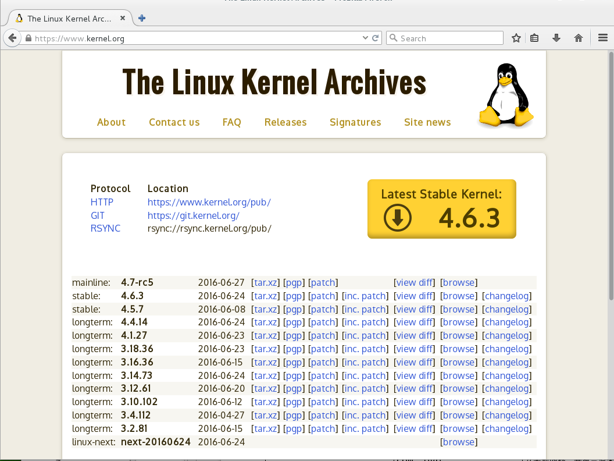
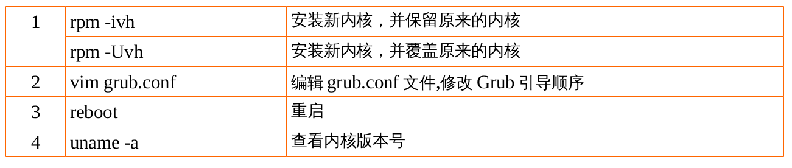
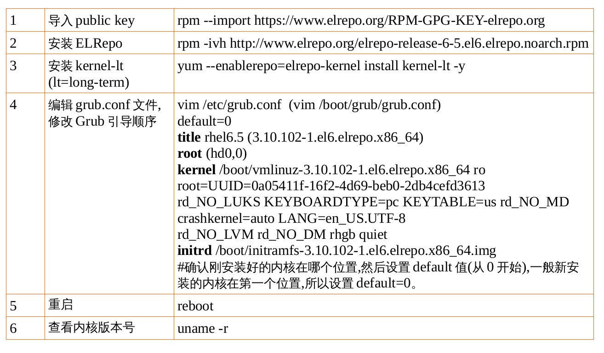
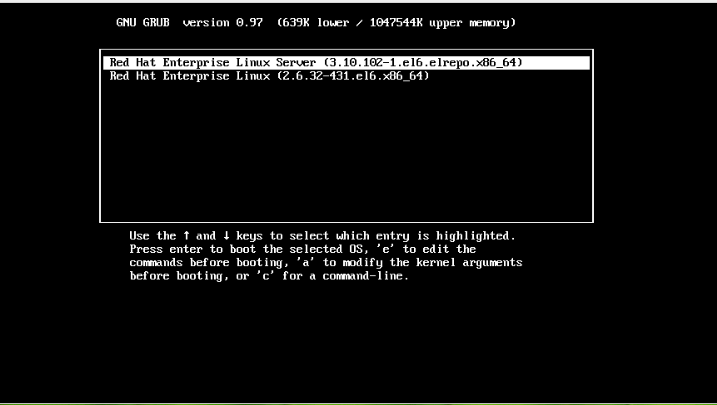
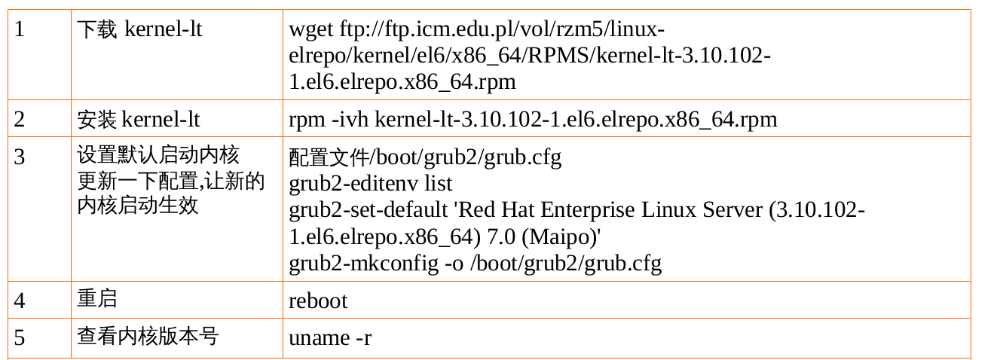

# Linux内核

[TOC]

## WHERE

内核与内核模块在哪里呢?内核模块都有哪些呢?下面的表中都列出来了:

* 内核 /boot/vmlinuz-version
* 内核解压缩所需 RAM Disk /boot/initrd-version
* 内核模块 /lib/modules/$(uname -r)/kernel

### WHAT

开机时,内核第一任务就是驱动硬件,激活机器。相关的驱动模块放在 `/lib/modules/$(uname -r)/` 目录下,下面以 rhel6 为例,看看该目录下都有些什么:

```shell
[root@rhel6 ~]# ls /lib/modules/2.6.32-431.el6.x86_64
build
modules.dep
modules.networking modules.usbmap
extra
modules.dep.bin
modules.ofmap
source
kernel
modules.drm
modules.order
updates
modules.alias
modules.ieee1394map modules.pcimap
vdso
modules.alias.bin modules.inputmap modules.seriomap weak-updates
modules.block
modules.isapnpmap modules.symbols
modules.ccwmap modules.modesetting modules.symbols.bin
[root@rhel6 ~]# ls /lib/modules/2.6.32-431.el6.x86_64/kernel/
arch crypto drivers fs kernel lib mm net sound
[root@rhel6 ~]# ls /lib/modules/2.6.32-431.el6.x86_64/kernel/drivers/
acpi
cpufreq hid
leds
net
rtc
vhost
ata
crypto hv
md
parport scsi video
atm
dca
hwmon
media pci
serial virtio
auxdisplay dma
i2c
memstick pcmcia ssb
watchdog
bcma
edac idle
message platform staging xen
block
firewire ieee802154 mfd
power
target
bluetooth firmware infiniband misc
pps
uio
cdrom
gpio
input
mmc
ptp
usb
char
gpu
isdn
mtd
regulator uwb
[root@rhel6 ~]# ls /lib/modules/2.6.32-431.el6.x86_64/kernel/drivers/net
3c59x.ko dl2k.ko
macvtap.ko
pppox.ko
sunhme.ko
8139cp.ko dnet.ko
mdio.ko
ppp_synctty.ko tehuti.ko
```

/lib/modules/2.6.32-431.el6.x86_64/kernel/ 该目录下的文件解释

* arch	与硬件平台有关的项目 , 例如 CPU 的等级等等 ;
* crypto 内核所支持的加密的技术 , 例如 md5 、 des 等等 ;
* drivers 硬件的驱动程序 , 例如显示适配器、网络卡、 PCI 相关硬件
* fs 内核所支持的 filesystems , 例如 ext4, vfat, reiserfs, nfs 等等 ;
* kernel 内核的程序、内核状态、线程、程序的排程 (schedule) 、程序的 signle 等
* lib 函式库
* mm 内存单元有关的各项数据
* net 与网络有关的各项协议数据,还有防火墙模块
* sound 音效有关的各项模块2 内核模块的相依性: depmod

### moudules.dep 文件

```shell
[root@rhel6 etc]# head /lib/modules/$(uname -r)/modules.dep
kernel/arch/x86/kernel/cpu/mcheck/mce-inject.ko:
kernel/arch/x86/kernel/cpu/cpufreq/powernow-k8.ko: kernel/drivers/cpufreq/freq_table.ko
kernel/arch/x86/kernel/cpu/cpufreq/mperf.ko
kernel/arch/x86/kernel/cpu/cpufreq/mperf.ko:
kernel/arch/x86/kernel/cpu/cpufreq/acpi-cpufreq.ko: kernel/drivers/cpufreq/freq_table.ko
kernel/arch/x86/kernel/cpu/cpufreq/mperf.ko
kernel/arch/x86/kernel/cpu/cpufreq/pcc-cpufreq.ko:
kernel/arch/x86/kernel/cpu/cpufreq/speedstep-lib.ko:
kernel/arch/x86/kernel/cpu/cpufreq/p4-clockmod.ko: kernel/drivers/cpufreq/freq_table.ko
kernel/arch/x86/kernel/cpu/cpufreq/speedstep-lib.ko
kernel/arch/x86/kernel/cpu/cpufreq/intel_pstate.ko:
kernel/arch/x86/kernel/test_nx.ko:
kernel/arch/x86/kernel/microcode.ko:
```

### depmod 命令

depmod [-Ane]

选项与参数 :

* -A : 不加任何参数时 , depmod 会主动的去分析目前内核的模块 , 并且重新写入`/lib/modules/$(uname -r)/modules.dep` 当中更新。若加入 -A 参数时 , 则 depmod 会去搜寻比 modules.dep 内还要新的模块,若找到新模块则
* -n : 不写入 modules.dep , 而是将结果输出到屏幕上 (standard out);
* -e : 显示出目前已加载的不可执行的模块名称

### depmod 实验

假设已经做好一个网卡驱动程序 , 档名为 a.ko, 请更新内核的相依性。

```shell
[root@rhel6 ~]# cp a.ko /lib/modules/2.6.32-
431.el6.x86_64/kernel/drivers/net
[root@rhel6 ~]# depmod3 内核模块的观察: lsmod, modinfo
```

### lsmod 命令

作用:显示出目前已经存在于内核当中的模块 , 显示的内容包括 :
1. 模块名称 (Module);
2. 模块的大小 (size);
3. 此模块是否被其他模块所使用 (Used by) 。

### modinfo 命令

用法:


modinfo [-adln] [module_name|filename]

选项与参数 :
* -a : 仅列出作者名称 ;
* -d : 仅列出该 modules 的说明 (description);
* -l : 仅列出授权 (license);
* -n : 仅列出该模块的详细路径。

### 内核模块的观察实验

首先查看目前已存在于内核中的模块,随便选择一个模块并查看该模块的详细信息。

```shell
[root@rhel6 ~]# [root@rhel6 ~]# lsmod
Module
Size
Used by
autofs4 26513 3
8021q 25349 0
garp
7152
1 8021q
[root@rhel6 ~]# modinfo autofs4
filename:
/lib/modules/2.6.32-
431.el6.x86_64/kernel/fs/autofs4/autofs4.ko
license: GPL
srcversion: 948FC9C8D4043379272927C
depends:
vermagic:
2.6.32-431.el6.x86_64 SMP mod_unload modversions
```

## 内核模块的加载与移除:insmod, modprobe, rmmod


modprobe 加载模块会主动去搜寻 modules.dep 的内容 , 先解决模块的相依性后 , 再决定需要加载的模块有哪些,很方便; insmod 则完全由使用者自行加载一个完整文件名的模块 , 不会主动分析模块相依性

### insmod 命令

insmod [/full/path/module_name] [parameters]

### modprobe 命令

modprobe [-lcfr] module_name

选项与参数 :
* -c : 列出目前系统所有的模块 !( 更详细的代号对应表 )
* -l : 列出目前在 /lib/modules/`uname -r`/kernel 当中的所有模块完整文件 名 ;
* -f : 强制加载该模块 ;
* -r : 类似 rmmod , 移除某个模块


### rmmod 命令

rmmod [-fw] module_name

选项与参数 :
* -f : 强制将该模块移除掉 , 不管是否正被使用 ;
* -w : 若该模块正被使用 , 则等该模块被使用完毕后 , 再移除


### 内核模块的加载与移除实验

加载模块;查看该模块是否已成功加载,并查看详细信息;移除该模块。

```shell
[root@rhel6 net]# modprobe dnet
[root@rhel6 net]# modinfo dnet
filename:
/lib/modules/2.6.32-431.el6.x86_64/kernel/drivers/net/dnet.ko
author:
Ilya Yanok <yanok@emcraft.com>, Matteo Vit <matteo.vit@dave.eu>
description: Dave DNET Ethernet driver
license:
GPL
srcversion: 9D532980E04E93088A9DFC1
depends:
vermagic:
2.6.32-431.el6.x86_64 SMP mod_unload modversions
[root@rhel6 net]# lsmod | grep dnet
dnet
16103 0
[root@rhel6 net]# rmmod dnet
[root@rhel6 net]# lsmod | grep dnet
```

## 内核模块的额外参数设定:/etc/modprobe.d/*.conf

```shell
[root@rhel6 ~]# ls /etc/modprobe.d/
anaconda.conf dist-alsa.conf dist-oss.conf
blacklist.conf dist.conf
openfwwf.conf
[root@rhel6 ~]# cat /etc/modprobe.d/dist.conf
# default modutils aliases
alias binfmt-204 binfmt_aout
alias binfmt-263 binfmt_aout
alias binfmt-264 binfmt_aout
alias binfmt-267 binfmt_aout
alias binfmt-387 binfmt_aout
alias block-major-1-* rd
alias block-major-3-* ide-probe-mod
alias block-major-8-* sd_mod
alias block-major-9-* md
alias block-major-11-* sr_mod
alias block-major-13-* xd
alias block-major-15-* cdu31a
alias block-major-16-* gscd
alias block-major-17-* optcd
alias block-major-18-* sjcd
alias block-major-20-* mcdx
alias block-major-22-* ide-probe-mod
alias block-major-23-* mcd
alias block-major-24-* sonycd535
alias block-major-25-* sbpcd
alias block-major-26-* sbpcd
alias block-major-27-* sbpcd
alias block-major-29-* aztcd
alias block-major-32-* cm206
alias block-major-33-* ide-probe-mod
alias block-major-34-* ide-probe-mod
alias block-major-37-* ide-tape
alias block-major-44-* ftl
alias block-major-46-* pcd
alias block-major-47-* pf
```

## 内核升级

### 源码编译

Linux 内核官网 https://www.kernel.org/ 提供的是源码,需要编译使用。



Linux 内核版本有两种 : 稳定版和开发版 ,Linux 内核版本号由 3 个数字组成 :r.x.y
* r: 主版本号
* x: 次版本号 , 偶数表示稳定版本 ; 奇数表示开发中版本。
* y: 修订版本号 , 表示修改的次数

去 http://www.kernel.org 首页 , 可以看到有 stable, longterm 等版本 ,longterm 是比stable 更稳定的版本 , 会长时间更新。

源码编译不做要求。

### rpm 包安装

在工作中应该去操作系统的发行公司的官网下载已经编译好的内核。我们使用的是红帽的,那么就去红帽的官网 https://www.redhat.com/en/global/china

这里使用一个免费的源 ELRepo 源



#### rhel6.5 内核升级 —— yum 方式(有网)

在 yum 的 ELRepo 源中 , 选择 kernel-lt-3.10.102-1.el6.elrepo.x86_64.rpm 这个版
本。



重新启动后的 grub 界面



```shell
[#1#root@rhel6 ~]#uname -r
3.10.102-1.el6.elrepo.x86_64
```

#### rhel7.2 内核升级 —— 本地 rpm 安装(没网)

此处是在 http://rpm.pbone.net 上下载的,实际工作中应该到红帽官网下载。



```shell
[root@rhel7 ~]# ls
anaconda-ks.cfg Downloads
Music Templates
Desktop
initial-setup-ks.cfg
Pictures Videos
Documents
kernel-lt-3.10.102-1.el6.elrepo.x86_64.rpm Public
```
查看但前系统内核版本

```shell
[root@rhel7 ~]# uname -r
3.10.0-123.el7.x86_64
```

安装新内核并保留原内核

```shell
[root@rhel7 ~]# rpm -ivh kernel-lt-3.10.102-1.el6.elrepo.x86_64.rpm
Preparing...
################################# [100%]
Updating / installing...
1:kernel-lt-3.10.102-1.el6.elrepo ################################# [100%]
[root@rhel7 ~]# cd /boot/grub2/
[root@rhel7 grub2]# ll /etc/grub2.cfg
lrwxrwxrwx. 1 root root 22 Jul 2 2015 /etc/grub2.cfg -> ../boot/grub2/grub.cfg
```

查看当前默认启动内核

```shell
[root@rhel7 grub2]# grub2-editenv list
saved_entry=Red Hat Enterprise Linux Linux, with Linux 3.10.0-123.el7.x86_64
```

查看配置文件中有几个启动项

```shell
[root@rhel7 grub2]# grep "menuentry" /boot/grub2/grub.cfg
if [ x"${feature_menuentry_id}" = xy ]; then
menuentry_id_option="--id"
menuentry_id_option=""
export menuentry_id_option
menuentry 'Red Hat Enterprise Linux Server (3.10.102-1.el6.elrepo.x86_64) 7.0 (Maipo)' --class red
--class gnu-linux --class gnu --class os --unrestricted $menuentry_id_option 'gnulinux-3.10.0-
123.el7.x86_64-advanced-5220f38d-edd6-45e5-a257-f1e9e6c80b4e' {
menuentry 'Red Hat Enterprise Linux Server, with Linux 3.10.0-123.el7.x86_64' --class red --class
gnu-linux --class gnu --class os --unrestricted $menuentry_id_option 'gnulinux-3.10.0-
123.el7.x86_64-advanced-5220f38d-edd6-45e5-a257-f1e9e6c80b4e' {
menuentry 'Red Hat Enterprise Linux Server, with Linux 0-rescue-14d17f362db9498eaa56aac326570c37' --class red --class gnu-linux --class gnu --class os
--unrestricted $menuentry_id_option 'gnulinux-0-rescue-14d17f362db9498eaa56aac326570c37-
advanced-5220f38d-edd6-45e5-a257-f1e9e6c80b4e' {
```

设置默认启动内核

```shell
[root@rhel7 grub2]# grub2-set-default 'Red Hat Enterprise Linux Server (3.10.102-
1.el6.elrepo.x86_64) 7.0 (Maipo)'
```

查看当前默认启动内核

```shell
[root@rhel7 grub2]# grub2-editenv list
saved_entry=Red Hat Enterprise Linux Server (3.10.102-1.el6.elrepo.x86_64) 7.0 (Maipo)
```

更新一下配置 , 让新的内核启动生效

```shell
[root@rhel7 grub2]# grub2-mkconfig -o /boot/grub2/grub.cfg
Generating grub configuration file ...
Found linux image: /boot/vmlinuz-3.10.102-1.el6.elrepo.x86_64
Found initrd image: /boot/initramfs-3.10.102-1.el6.elrepo.x86_64.img
Found linux image: /boot/vmlinuz-3.10.0-123.el7.x86_64
Found initrd image: /boot/initramfs-3.10.0-123.el7.x86_64.img
Found linux image: /boot/vmlinuz-0-rescue-14d17f362db9498eaa56aac326570c37
Found initrd image: /boot/initramfs-0-rescue-14d17f362db9498eaa56aac326570c37.img
done
```

重新启动

```shell
[root@rhel7 grub2]# reboot
```

查看当前内核版本

```shell
[root@rhel7 ~]# uname -r
3.10.102-1.el6.elrepo.x86_64
```

## Linux 内核作业
1. 到共享当中下载 linux 内核 kernel-lt-3.10.102-1.el6.elrepo.x86_64.rpm
2. rhel6.5 进行内核升级,保留原内核
3. rhel7.2 进行内核升级,保留原内核
